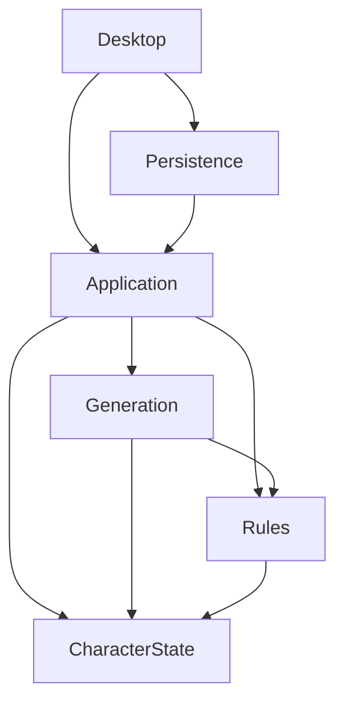

# M01 Architecture and Boundary Report

## Dependency diagram

## Boundary responsibilities

### CharacterState

Owns stable domain value objects and mutable in-progress character state. It contains no Rules, persistence, workflow, or UI dependency.

### Rules

Owns deterministic validation, prerequisite evaluation, legality evaluation, derived calculations, breakdowns, and audit models. It depends only on CharacterState.

### Generation

Reserved for controlled character-generation orchestration. It may consume Rules and CharacterState but has no M01 behavior.

### Application

Reserved for UI-neutral workflow coordination. It may coordinate Generation, Rules, and CharacterState but has no M01 behavior.

### Persistence

Reserved for serialization, files, recovery, and import/export implementations. It depends on Application and has no M01 behavior.

### Desktop

Reserved for cross-platform presentation. It consumes Application and Persistence and has no M01 behavior.

## Enforcement

- Exact project references are checked by `ProjectDependencyPolicyTests`.
- Rules metadata is inspected for prohibited infrastructure type references.
- Rules member references are inspected for ambient clock access.
- Rules reflection checks reject user-authored mutable static fields.
- Strict analyzers, warnings as errors, formatting, nullable analysis, and deterministic builds apply across the solution.

## Boundary rationale

- Character state and rules are reusable without desktop or persistence.
- Rules accept explicit inputs and do not own infrastructure.
- Persistence is downstream from workflow coordination.
- Desktop is a consumer rather than an owner of domain behavior.
- Generation cannot bypass Rules and CharacterState.
- Application exists to prevent UI and persistence orchestration from leaking into domain projects.

## Known boundary limitations

- The prohibited dependency detector is deny-list based and must evolve when new libraries are introduced.
- M01 proves project and assembly boundaries; it does not yet prove package-version compatibility.
- No desktop or persistence implementation exists to test runtime integration boundaries.
